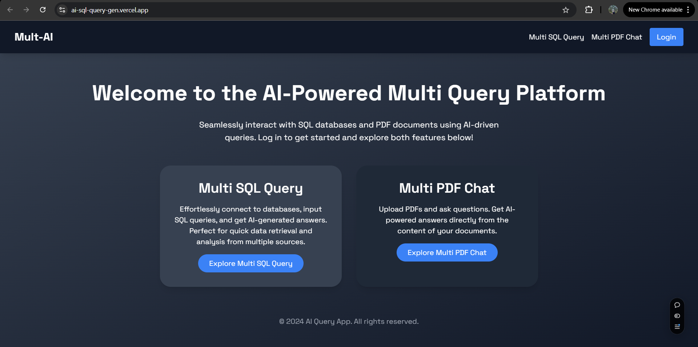

# Overview of whole system

## Home Screen 

  

 

## Multi PDF Chat

## Extracted information from uploaded pdf

  

 

## Hinglish Translation #1

  

 

## Hinglish Translation #2

  

 

## Hindi Translation

  

 

## Multi Sql Chat

## Workflow

  

 

## Workflow Explanation

### Image Description
The image is a flowchart illustrating the workflow of a system that processes user questions into natural language responses using SQL queries and large language models (LLMs). The diagram is divided into two main sections: the SQL Chain and the Full Chain. The SQL Chain involves the initial processing of user questions by an LLM, which uses the database schema to generate an SQL query. The Full Chain includes running the SQL query, processing the results with another LLM, and producing a natural language response.

### User Questions
- The process begins with user questions being input into the system.

### SQL Chain
- **LLM (Large Language Model)**: The user questions are processed by an LLM, which uses the database schema to understand the structure and content of the database.
- **Database Schema**: The LLM refers to the database schema to generate an appropriate SQL query based on the user questions.
- **SQL Query**: The LLM generates an SQL query that is designed to retrieve the necessary data from the database.

### Full Chain
- **Run Query**: The generated SQL query is executed against the database to fetch the required data.
- **LLM (Large Language Model)**: The results from the SQL query are processed by another LLM to convert the data into a natural language response.
- **Natural Language Response**: The final output is a natural language response that answers the user's original question.

## Multi Sql query chat #1

  

 

## Multi Sql query chat #2

  

 

## Multi Sql query chat #3

  

 

## Multi Sql query chat #4

  

 

## Discount mail is sent to the user

  

 
